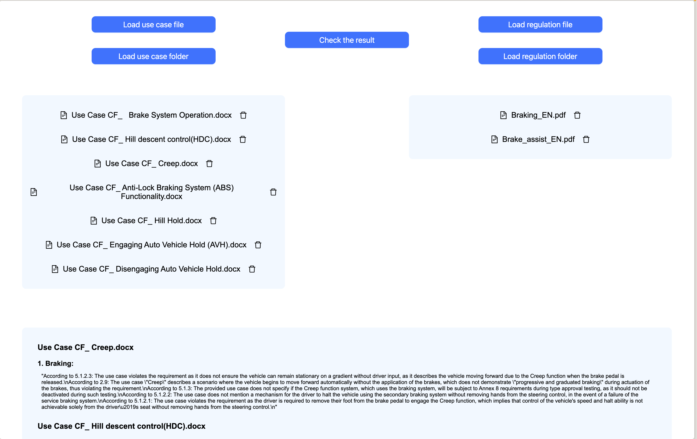

# Atom
Created as part of the hackathon "Окружной хакатон СЗФО Россия - страна возможностей 2024"

# Spring Boot Application Documentation

## Overview

This Spring Boot application is designed to process and analyze Use Cases against regulatory documents. It provides functionality to upload Use Case and regulation files, extract relevant information, and perform checks to ensure compliance with regulations.

## Components

### 1. CheckUCController

**File**: `CheckUCController.java`

This controller handles the main functionality of the application:

- **Endpoint**: `/api/check-uc`
- **Method**: POST
- **Purpose**: Handles the upload of Use Case and regulation files, processes them, and returns a list of responses for each Use Case.

#### Key Features:
- Accepts multiple Use Case files and regulation files as input.
- Checks input files for valid extensions.
- Reads and processes regulation files (PDF) and Use Case files (DOCX).
- Matches Use Cases with relevant regulations based on system names.
- Sends data to an AI service for analysis.
- Returns a structured response containing analysis results for each Use Case.

### 2. RegulationItemisationService

**File**: `RegulationItemisationService.java`

This service is responsible for parsing and itemizing regulation documents:

#### Key Features:
- Splits regulation content into sections based on specific patterns.
- Handles different point formats (GOST and UNITED NATIONS standards).
- Extracts individual requirements from the regulation text.
- Provides logic to validate the sequence of points in the regulation.

### 3. NameRelationService

**File**: `NameRelationService.java`

This service determines if two names (e.g., system names or regulation names) are related:

#### Key Features:
- Checks for common words between two names.
- Analyzes relationships through abbreviations.
- Performs similarity analysis between strings.

### 4. PdfReadService

**File**: `PdfReadService.java`

This service handles the reading and processing of PDF files containing regulations:

#### Key Features:
- Extracts text content from PDF files.
- Applies specific formatting rules to clean up the extracted text.
- Removes certain patterns and irrelevant information from the text.

### 5. DocxReadService

**File**: `DocxReadService.java`

This service is responsible for reading and processing DOCX files containing Use Cases:

#### Key Features:
- Extracts text content from DOCX files.
- Identifies and extracts system names (regulations) from the Use Case text.
- Creates `UseCaseDto` objects containing the full text and list of associated system names.

## Data Flow

1. User uploads Use Case (DOCX) and regulation (PDF) files through the `/api/check-uc` endpoint.
2. `CheckUCController` receives the files and initiates the processing.
3. `PdfReadService` extracts and cleans text from regulation PDFs.
4. `DocxReadService` extracts Use Case text and associated system names from DOCX files.
5. `NameRelationService` is used to match Use Cases with relevant regulations.
6. `RegulationItemisationService` breaks down regulations into individual requirements.
7. The controller sends the matched Use Case and regulation data to an AI service for analysis.
8. The results are compiled and returned as a structured response.

## Key DTOs

- `UseCaseDto`: Contains the full text of a Use Case and its associated system names.
- `UcResponseDto`: Represents the response for a single Use Case, including analysis results for each relevant regulation.
- `RegulationResponseDto`: Contains the analysis results for a specific regulation.
- `RequirementDto`: Represents an individual requirement extracted from a regulation.

# React

## DocumentVerification Component

### Overview

`DocumentVerification` home page component. It integrates two child components: `FileUpload` for
uploading and displaying files and `CheckResult` for displaying the check results. It manages the
state to hold the check result.

### State

- `checkResult`: Array that stores the check result of files.

## FileUpload Component

### Overview

`FileUpload` component handles file uploading and displaying for two types of files: use case files
and regulation files. It allows users to select files from their system, remove them from the list, and
submit them to a server for checking.

### Props

- `setCheckResult`: A function to update check result in the parent component.

### State

- `useCaseFiles`: Array of selected use case files.
- `regulationFiles`: Array of selected regulation files.
- `loading`: A boolean to indicate if the file checking is in progress.

### Functions

- `handleUseCaseFileChange`: Handles addition of use case files to the useCaseFiles state.
- `handleRegulationFileChange`: Handles addition of regulation files to the regulationFiles state.
- `handleSubmit`: Sends the selected files to the server for checking using a POST request.
- `handleDeleteUseCaseFile`: Removes use case file from the list.
- `handleDeleteRegulationFile`: Removes regulation file from the list.

## CheckResult Component

### Overview

`CheckResult` component displays the check result. It gets comments on each use case file and
displays it.

### Props

- `checkResult`: Array containing check result. Each item has:
  - `fileName`: Name of the file.
  - `regulations`: Array of regulation objects, Each object has:
    - `name`: Name of the regulation.
    - `comment`: Comment associated with the regulation.

# Screenshots
